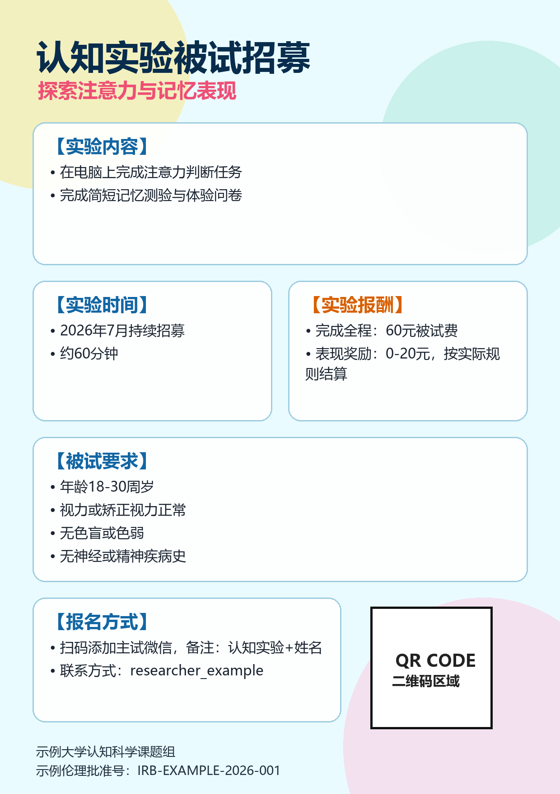

# Subject Recruitment Poster Skill

Generate polished participant recruitment posters for psychology, neuroscience, behavioral, questionnaire, online-game, fNIRS, EEG, eye-tracking, MRI, and other human-subject studies.

This skill is designed for WeChat group recruitment posters and similar campus recruitment visuals. It focuses on three things:

- Clear information structure: title, study content, time, reward, requirements, location, signup, QR, ethics.
- Prompt-first visual generation: use image generation first, then fallback to deterministic text overlay or HTML only when needed.
- Public-safe examples: bundled examples use synthetic data only and do not contain real experiment records.



## What This Skill Does

`subject-recruitment-poster` helps an agent turn rough experiment details into a recruitment poster workflow:

1. Ask the user for missing study details with a structured input template.
2. Normalize the details into a poster brief.
3. Choose an appropriate visual style based on study method, audience, urgency, and information density.
4. Generate a prompt for the available image model.
5. If the image model can render Chinese reliably, generate the complete poster directly.
6. If the model may distort Chinese, generate a no-text background first, then overlay real text and reserve/insert QR.
7. Use HTML only as a fallback when image generation is unavailable.

## Recommended Generation Strategy

Use this order by default:

1. `gpt-image-direct-text`

   Use this when the image model reliably renders Chinese text. The prompt includes exact Chinese copy, layout, typography hierarchy, background motifs, QR placeholder, and a strict "no extra text" instruction.

2. `background-plus-overlay`

   Use this when the model is strong visually but unreliable with Chinese text. Generate a background with blank cards and QR space, then run `scripts/compose_poster_text.py` to place real text deterministically.

3. `html-fallback`

   Use this only when no image generation tool is available or the user explicitly wants an editable HTML draft.

## User Input Template

Ask users to fill this when details are incomplete:

```text
请按下面信息生成被试招募海报：
1. 实验名称/标题：
2. 一句话卖点/招募重点：
3. 实验类型/方法：
4. 实验内容：
5. 实验时间和时长：
6. 实验地点或线上平台：
7. 被试要求：
8. 报酬/奖励/路补：
9. 报名方式/二维码/联系人：
10. 备注格式：
11. 伦理批准号/课题组：
12. 风格偏好/参考图：
```

For a fuller form, see [references/input-template.md](references/input-template.md).

## Poster Brief Schema

The skill normalizes user input into this structure:

```json
{
  "title": "认知实验被试招募",
  "hook": "探索注意力与记忆表现",
  "study_type": "行为实验",
  "experiment_content": [
    "在电脑上完成注意力判断任务",
    "完成简短记忆测验与体验问卷"
  ],
  "time": "2026年7月持续招募",
  "duration": "约60分钟",
  "compensation": "完成全程：60元被试费",
  "bonus_or_transport": "表现奖励：0-20元，按实际规则结算",
  "eligibility": [
    "年龄18-30周岁",
    "视力或矫正视力正常",
    "无色盲或色弱",
    "无神经或精神疾病史"
  ],
  "location": "示例大学心理学实验中心 A101 室",
  "signup": "扫码添加主试微信，备注：认知实验+姓名",
  "contact": "researcher_example",
  "ethics": "示例伦理批准号：IRB-EXAMPLE-2026-001",
  "organizer": "示例大学认知科学课题组",
  "qr_code": "",
  "qr_slot": "bottom-right reserved blank square",
  "style": "data-card",
  "generation_mode": "background-plus-overlay"
}
```

The included [assets/example-brief.json](assets/example-brief.json) uses this synthetic example.

## Style System

The style system is intentionally broader than the original reference posters. It is meant to produce cleaner, more deliberate outputs rather than copying screenshots.

Available directions include:

- `neuro-tech-premium`: formal neuroscience, MRI, EEG, fNIRS, high-reward studies.
- `warm-social-lab`: interpersonal interaction, communication, social fNIRS.
- `editorial-minimal`: text-heavy posters with exact constraints and safety notes.
- `data-card`: behavioral tasks, questionnaires, AI/reading/scoring studies.
- `playful-collage`: approachable student recruitment with cutout/sticker motifs.
- `urgent-comic`: same-day recruitment, missing slots, gender-specific urgency.
- `soft-watercolor`: calm small-batch campus recruitment.
- `retro-digital`: online games, HCI, coding or avatar tasks.
- `safety-explainer`: fNIRS, tES, EEG, MRI safety reassurance.
- `campus-zine`: peer-to-peer undergraduate recruitment.
- `high-reward-billboard`: high compensation as the main conversion hook.
- `clinical-trust`: formal, ethics-heavy, safety-sensitive posters.

See [references/style-system.md](references/style-system.md) for selection rules, visual language, layout suggestions, and avoid-list guidance.

## Research-Relevant Backgrounds

Backgrounds should not be generic decoration. The prompt should connect visual motifs to the actual study:

- Behavioral judgment: grids, reaction keys, target dots, decision cards.
- Memory/language: abstract word cards, memory tiles, book/page shapes without readable fake text.
- fNIRS/social interaction: two avatars, head-cap silhouettes, signal waves, dialogue bubbles.
- EEG: electrode dots, head silhouette, calm waveform motifs.
- MRI/fMRI: scanner ring, tunnel perspective, brain network mesh.
- Online questionnaire/game: laptop, phone, form cards, cloud nodes, avatar tiles.
- Acoustic/speech: microphone, sound waves, speech bubbles.

See [references/prompt-workflow.md](references/prompt-workflow.md) for prompt templates and layout density rules.

## Running The Overlay Script

Install the only runtime dependency:

```bash
pip install -r requirements.txt
```

Generate a poster with the synthetic example:

```bash
python scripts/compose_poster_text.py assets/example-brief.json --output poster.png
```

Use a generated no-text background:

```bash
python scripts/compose_poster_text.py assets/example-brief.json --background background.png --output poster.png
```

If `qr_code` points to a local QR image, the script inserts it. If `qr_code` is empty, it reserves a clean QR placeholder.

For better Chinese typography, set local CJK fonts:

```bash
set POSTER_FONT=C:\Windows\Fonts\msyh.ttc
set POSTER_FONT_BOLD=C:\Windows\Fonts\msyhbd.ttc
```

On macOS/Linux, use the equivalent font paths, for example PingFang or Noto Sans CJK.

## HTML Fallback

HTML is not the default generation path. It is retained for environments without image generation:

```bash
python scripts/render_poster_html.py assets/example-brief.json --output poster.html
```

The fallback creates a standalone 9:16 HTML poster with real text and QR placeholder.

## Directory Structure

```text
subject-recruitment-poster/
├── SKILL.md
├── README.md
├── requirements.txt
├── agents/
│   └── openai.yaml
├── assets/
│   ├── example-brief.json
│   ├── example-composed-poster.png
│   └── example-poster.html
├── references/
│   ├── input-template.md
│   ├── poster-analysis.md
│   ├── prompt-workflow.md
│   └── style-system.md
└── scripts/
    ├── compose_poster_text.py
    └── render_poster_html.py
```

## Privacy And Public Sharing

The repository is prepared for public sharing:

- Example data is synthetic.
- Example contact, location, organizer, and ethics approval are placeholders.
- The bundled example QR region is a placeholder, not a real QR code.
- Do not commit real participant data, real WeChat IDs, real QR codes, or private chat logs.
- If you adapt this skill with real lab examples, keep them in a private fork or replace identifying details before publishing.

## Validation

Validate the skill frontmatter and structure:

```bash
python -X utf8 path/to/skill-creator/scripts/quick_validate.py .
```

Smoke-test the local scripts:

```bash
python scripts/compose_poster_text.py assets/example-brief.json --output poster.png
python scripts/render_poster_html.py assets/example-brief.json --output poster.html
```

## License

No license is currently specified. Add one before broad public reuse if you want to define redistribution and modification rights.
